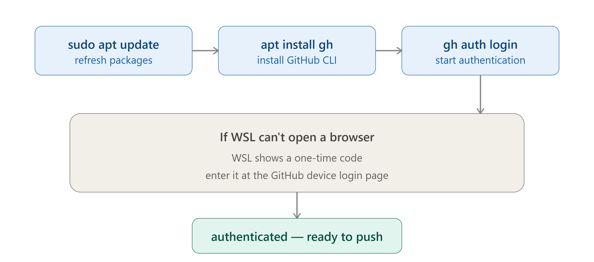
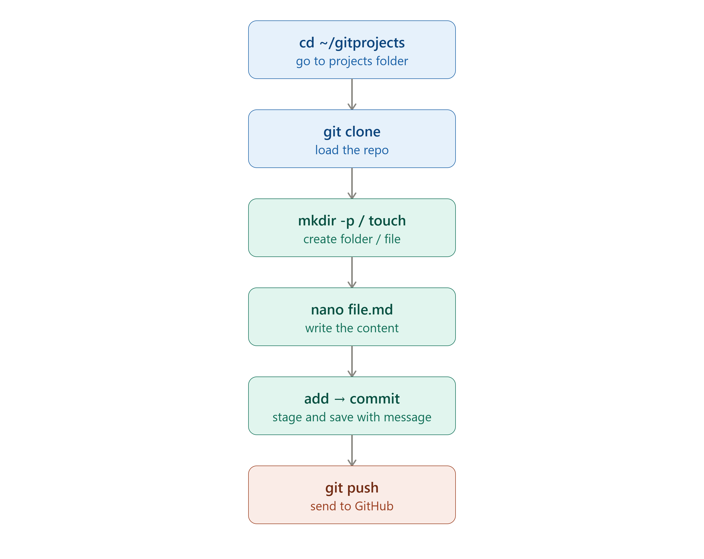
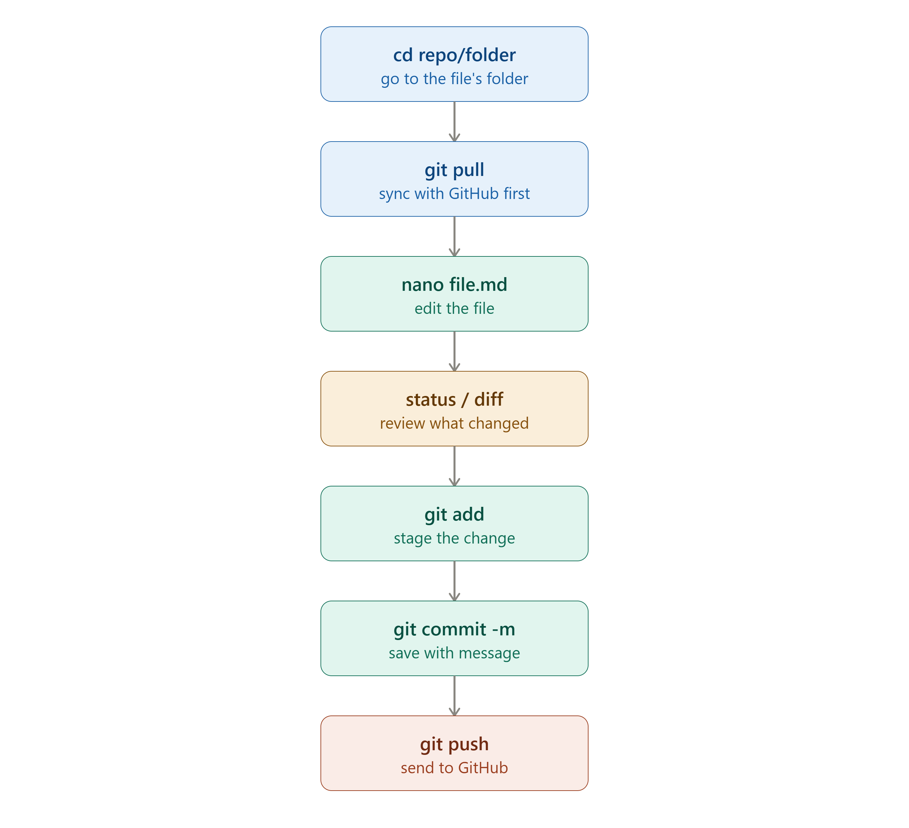
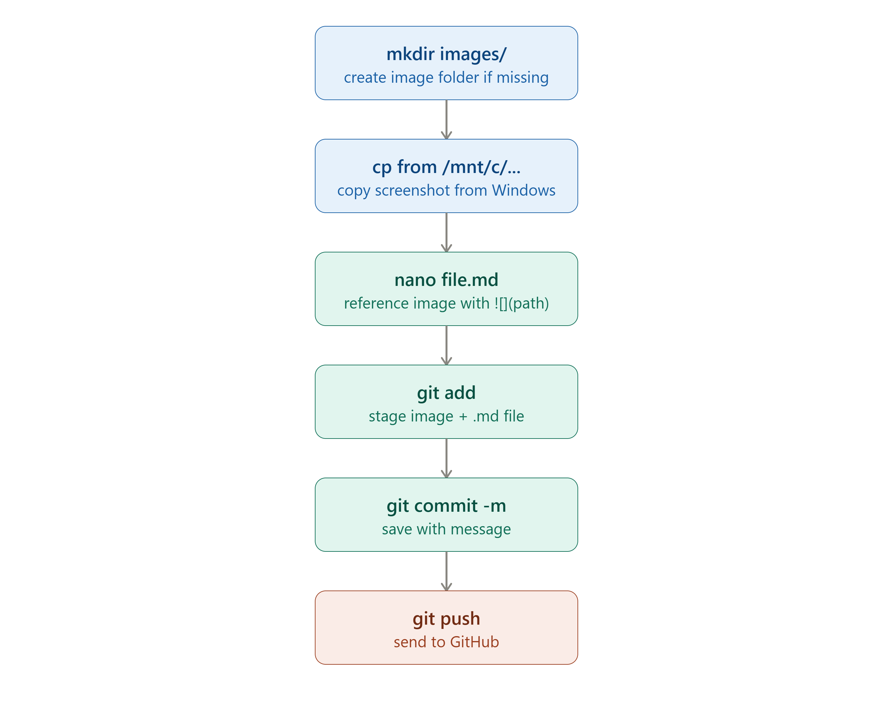

# Git hub Login: 

**Via WSL:**
- sudo apt update
- sudo apt install gh -y
- gh auth login
Note: Here if the aut not possible via WSL, you wiull get a code in the WSL session and a Github Portal address so you can auth with that code. 

## Diagram:


# Modify a Repository or add inforamtion:

Move to the projects folder in your local PC (WSL - ~/gitprojects/)
- cd ~/gitprojects/

Load the repo you need to modify:
- git clone https://github.com/kajuare/Repo-Name.git

Create either the .md file you want to add or the folder you need.
- mkdir -p Folder-Name
- touch File-Name.md -> Add the content via Vi or Nano. 
- nano Folder-Name/File-Name.md

Prepare the change: 
- git add Folder/File.md

Confirm Change with a message: 
- git commit -m "Message"

Push the change to the file in GitHub Repo:
- git push

## Diagram:


# To Update a file: 

Go to the repo fodler:
- cd ~/gitprojects/Repo-Name/Folder-Name/

Review if current dat local is updated with the one in Git Repo:
- git pull

Edit the file you need to update: 
- nano Folder-Name/Fileto-to-modify.md

Review the change:
- git status
- git diff

Prepare the change: 
- git add 01-identity/entra-id-basics.md
 
Confirm Change with a message: 
- git commit -m "Message"

Push the change to the file in GitHub Repo:
- git push

## Diagram:


# To recover a file verions from a commit: 
- git restore <filename>
    note: it till restore the last version of the file that was commited.

# To recover a staged file: 
- git restore --staged <filename>
    note: this takes the file version from stagin to modified area.
- git rm --cache <filename>
    note: this takes the file version from stagin to untracked.

# To exclude files from git radar ot be taking in count:
- Create a file ".gitignore" and add the name of the files you want git to ignore. 

# To upload images: 

If there is no specific folder for images, crete it: 
- mkdir /gitprojects/Repository/ImageFolder
- cp /mnt/c/Users/YOUR_WINDOWS_USERNAME/Downloads/screenshot.png ~/gitprojects/gitprojects/Repository/ImageFolder/ImageName.png

Commit and push like normal:
- git add Repo-Folder/Image-Folder/IMAGE.png Repo-Folder/File-name.md
or
- git add GitHub/   -- this informs abput multiple changes on the specific repo.
- git commit -m "Add SSPR config screenshot to Entra ID notes"
- git push

## Diagram:


# Monitoring changes: 

To review modifications and commits: 
- git log
- git log --name-only
    note: list the files changed. 
- git log --oneline
    note: shows the commit ID and message.
- git log --graph --decorate
    note: lets you review from which branch a brahc was creted from. 
- git log --graph --oneline --decorate --all
    note: shows you a little graph and which branches sahre common ancestor. 
- git reflog --all
    note: shows you a full log of the actions taken. 
- git stash 
    note: sets the changes in a waiting area without commit. 
- git stash pop 
    note: takes stashed changes back to the working area. 
- git stash list
    note: shows all stashed files
- git stash show stash@{1}
    note: shows the content of the specific stash. 
- git stash pop stash@{1}
    note:  return the specific stashed file tothe working area. 
- git revert <has # of the commit>
    Note: the revert option keeps the changes if latter needs to be used.
- git reset --soft HEAD~# (the number refers to the positions you need to undo starting from 0).
    Note: flag --soft helps keep the changes - --hard flag helps discard the changes. 
- git reflog
    note: shows a history of the actions taken. 


# Manage branches: 

To create a new branch:
- git branch <branch name>

Switch to an existing branch:
- git checkout sarah

To create a new branch and switch to it: 
- git checkout -b <branch name>

To review on which branch are you working on:
- git branch

To review branch is updated with the origin:
- git branch -vv

To make local branch to appear in Github: 
- git push -u origin <branch name>

Delete a branch:
- git branch -d max

See al local and remote branches: 
- git branch -a

To get chenges done in the main branch added to our local branch: 
- git fetch origin master

To fetch and merge remote changes to our local master branch: 
- git pull origin master


# Merging branches: 

## Fast-forward merge: 
**The current master or main branch do not have any update or recent change ahead of the branch we want to merge.**

- git checkout master
- git merge <BranchName>


# Understanding Git Merge: Fast-Forward vs. No-Fast-Forward (`--no-ff`)

When you merge one branch into another in Git, Git decides how to combine the histories. The two main ways it handles this are **Fast-Forward** and **No-Fast-Forward** merges.

---

## 1. Fast-Forward Merge (`git merge`)

### What is it?
A Fast-Forward merge happens automatically when there are **no new commits on `<main branch name>`** since you created `<own branch name>`. 

Instead of creating a new "merge commit," Git simply moves the tip of `<main branch name>` forward to point at the latest commit of `<own branch name>`.

### Before Merge:
```text
C0 --- C1 ( <main branch name> )
         \
          C2 --- C3 ( <own branch name> )
```

### Commands to execute:
```bash
# Switch to the target branch
git checkout <main branch name>

# Merge your feature branch (defaults to fast-forward if possible)
git merge <own branch name>
```

### After Merge:
```text
C0 --- C1 --- C2 --- C3 ( <main branch name>, <own branch name> )
```

### Key Takeaways:
* **History:** Linear and clean. Looks like all work was done directly on `<main branch name>`.
* **Merge Commit:** None is created.
* **Best for:** Small, quick features or individual bug fixes.

---

## 2. No-Fast-Forward Merge (`git merge --no-ff`)

### What is it?
A No-Fast-Forward merge forces Git to create a **dedicated merge commit**, even if a fast-forward merge is possible. 

This preserves the explicit history that `<own branch name>` existed as a separate group of commits before being combined into `<main branch name>`.

### Before Merge:
```text
C0 --- C1 ( <main branch name> )
         \
          C2 --- C3 ( <own branch name> )
```

### Commands to execute:
```bash
# Switch to the target branch
git checkout <main branch name>

# Force a merge commit
git merge --no-ff <own branch name> -m "Merge branch '<own branch name>' into <main branch name>"
```

### After Merge:
```text
C0 --- C1 ----------- M ( <main branch name> )
         \           /
          C2 --- C3 ( <own branch name> )
```
*(Where `M` is the newly created merge commit)*

### Key Takeaways:
* **History:** Non-linear. Clearly shows the branch topology and when features were integrated.
* **Merge Commit:** Always created (`M`).
* **Best for:** Pull requests, multi-commit feature branches, or shared team branches where keeping context is important.
---

## Summary Comparison

| Feature | Fast-Forward (`git merge`) | No-Fast-Forward (`git merge --no-ff`) |
| :--- | :--- | :--- |
| **Merge Commit Created?** | No | Yes |
| **Git History** | Straight line (Linear) | Branching tree (Non-linear) |
| **Easy to revert full feature?** | Harder (must revert individual commits) | Easier (revert the single merge commit `M`) |
| **Default behavior?** | Yes (if no diverging commits exist) | No (must pass `--no-ff` flag) |


# Key concept

## Branches contain commits, not uncommitted files.
**An untracked or uncommitted file belongs to the working directory, not to a branch.**

# Git commands

## Porcelain commands: 
git add 
git status
git commit
git stash

## Plumbing commands:
git hash-object 
git ls-files
git rev-parse
git ls-remote
git cat-file -p <first portion of the hash of the commit>

# Git Object Contents: 
**Folders in the Object folder can be next types:** 

Commit: just a commit  
tree: folder on your file system asociated with the repository.
blob: PIECE OF DATA 
